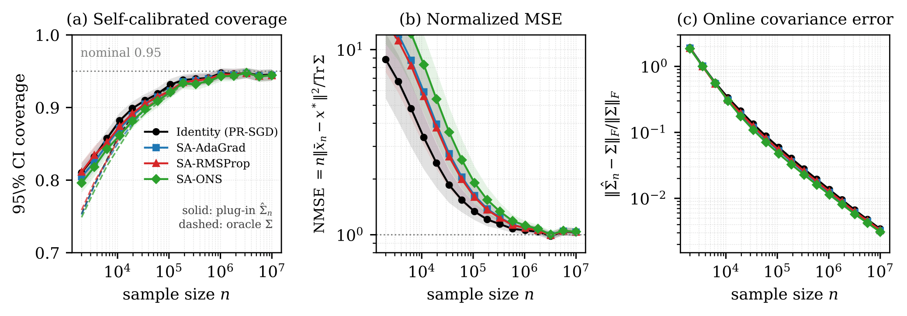

# When Does Adaptive Preconditioning Preserve Valid Inference?
### A Stabilization Threshold for Streaming Quality Monitoring

**Sunyoung An**, Xiaoming Huo — H. Milton Stewart School of Industrial and Systems
Engineering, Georgia Institute of Technology.

This repository holds the **exact experiment code** behind the paper's three
figures and its control-chart table. The paper itself is not included here while
it is under review; it will be posted once review is complete. The underlying
theory is already public as [arXiv:2604.23498](https://arxiv.org/abs/2604.23498).

> Online quality monitoring increasingly runs on adaptive optimizers (AdaGrad,
> RMSProp), but are their one-pass control limits *calibrated*? We give a
> checkable stabilization threshold under which the Polyak–Ruppert-averaged
> estimate is efficient at the sandwich covariance, so one-pass Wald limits — and
> the running limits of a streaming control chart — stay valid. Deployed
> constant-gain RMSProp/Adam instead false-alarm several-fold, shown on
> semiconductor-manufacturing (SECOM) data.



*On the real SECOM semiconductor stream, the one-pass plug-in interval (solid)
tracks the oracle (dashed) to nominal 95% coverage, and all four certified
optimizers coincide — the limits calibrate themselves from the stream, with no
Phase I sample.*

### Quick start

Every figure redraws from the committed CSVs in **under a minute** — no cluster,
no simulation:

```bash
pip install -r experiments/requirements.txt
./experiments/make_figures.sh
```

**Results.**

* **A certified optimizer calibrates its own limits.** On the SECOM stream
  (d = 21, κ(H) ≈ 7, ‖S−H‖/‖H‖ ≈ 0.6) the one-pass plug-in interval reaches
  ≈0.945 coverage against a nominal 0.95 — from the stream alone, with no Phase I
  sample.
* **A deployed constant-gain optimizer does not.** Fixed-EMA RMSProp/Adam violate
  the threshold and plateau below nominal — 0.949 / 0.894 / 0.810 for certified SA
  vs. EMA 0.5 vs. EMA 0.999 at n = 5×10⁷ — over-alarming two- to nearly four-fold,
  ≈1500 avoidable interventions per 10⁴ in-control lots.
* **The resulting chart holds its design run length**, with a per-sample ARL₀ ≈ 18
  against a nominal 20, and drives a certified change detector (Fig. 3).

---

## 1. Contents

```text
.
├── LICENSE                         # MIT — covers the code under experiments/
├── NOTICE                          # terms for the SECOM data and the figures
├── figs/
│   ├── fig_secom.pdf               # Fig. 1  §6.2  SECOM self-calibration (3 panels)
│   ├── fig_threshold.pdf           # Fig. 2  §6.3  threshold violation (constant-EMA)
│   └── fig_detect.pdf              # Fig. 3  §6.5  certified change detection
├── experiments/
│   ├── requirements.txt
│   ├── secom_data/                 # UCI SECOM dataset (see §4)
│   │   ├── ATTRIBUTION.md          #   source, DOI, CC BY 4.0 credit
│   │   ├── secom.data
│   │   └── secom_labels.data
│   ├── run_secom_redesign.py       # produces secom_redesign_anchor_d21_prod.csv
│   ├── make_fig_secom.py           #   -> fig_secom.pdf
│   ├── run_threshold_coverage.py   # produces threshold_coverage_summary.csv
│   ├── make_fig_threshold.py       #   -> fig_threshold.pdf
│   ├── run_secom_detect4.py        # produces secom_detect4_summary.csv
│   ├── make_fig_detect.py          #   -> fig_detect.pdf
│   ├── prodA.sbatch                # SLURM job used for the production SECOM run
│   ├── make_figures.sh             # regenerate all three figures from results/
│   ├── run_experiments.sh          # re-run the experiments: `smoke` or `full`
│   └── results/                    # the CSVs behind the paper's numbers
│       ├── secom_redesign_anchor_d21_prod.csv   # Fig. 1
│       ├── threshold_coverage_summary.csv       # Fig. 2 + Table 2
│       └── secom_detect4_summary.csv            # §6.5 text numbers
└── README.md
```

Everything in `experiments/results/` is committed, so **every figure in the paper
can be regenerated in seconds without re-running the multi-hour simulations**:

```bash
pip install -r experiments/requirements.txt
./experiments/make_figures.sh
```

---

## 2. What produces what

| Paper item | Figure/table | Compute script (slow) | Intermediate CSV | Plot script (fast) |
|---|---|---|---|---|
| §6.2 SECOM self-calibration | Fig. 1 `fig_secom.pdf` | `run_secom_redesign.py` (`SECOM_MODE=anchor`) | `secom_redesign_anchor_d21_prod.csv` | `make_fig_secom.py` |
| §6.3 Threshold violation | Fig. 2 `fig_threshold.pdf` | `run_threshold_coverage.py` | `threshold_coverage_summary.csv` | `make_fig_threshold.py` |
| §6.4 Control chart / ARL₀ | Table 2 | — (read off §6.3 coverage) | `threshold_coverage_summary.csv` | — |
| §6.5 Change detection | Fig. 3 `fig_detect.pdf` | — (figure re-simulates from `secom_data/`) | — | `make_fig_detect.py` |
| §6.5 ARL₀ / delay numbers *in the text* | — | `run_secom_detect4.py` (`D_MODE=stat`, then `arl`) | `secom_detect4_summary.csv` | — |

Notes:

* **Table 2 has no script of its own.** Its three rows are `ARL₀ = 1/(1 − coverage)`
  applied to the final-`n` coverage of `sa_rmsprop`, `ema_05`, `ema_099` in
  `threshold_coverage_summary.csv`.
* **§6.1 (synthetic $d=50$ CLT check) is text-only in the final version** — its
  figure was dropped when the paper was cut to six pages ("we omit the synthetic
  plot"), so no script for it is shipped here.
* **`make_fig_detect.py` reads no CSV.** The final Fig. 3 is a single panel — one
  representative control-chart run — which the script re-simulates from
  `secom_data/` using the same monitor as `run_secom_detect4.py` (it scans seeds
  from 10000 for a clean trace, so it is deterministic). Its docstring still
  describes a two-panel version; the second panel was cut for the page limit.
  The other two plot scripts read only their CSV.
* `run_secom_detect4.py` therefore backs the §6.5 *prose* numbers, not the figure:
  `D_MODE=stat` gives the in-control check (mean T̄ = 21.0 at nominal d = 21,
  ARL₀ ≈ 4×10⁴ observations) and `D_MODE=arl` gives the detection delays
  (≈1.6×10⁴ observations at a 1-SD shift falling to ≈4×10³ at 3 SD).

---

## 3. Python environment

Python **≥ 3.9** (developed on 3.9–3.11; the cluster runs `anaconda3/2023.03`).

```bash
conda create -n qsr2026 -c conda-forge python=3.11 \
  numpy scipy pandas matplotlib scikit-learn numba
conda activate qsr2026
```

or equivalently `pip install -r experiments/requirements.txt`.

This environment was **built and exercised from scratch** on 2026-08-20 to verify
the instructions in this file. Resolved versions, all of which work: Python 3.11,
numpy 2.4.6, scipy 1.17.1, pandas 3.0.5, matplotlib 3.11.1, scikit-learn 1.9.0,
numba 0.67.0. The code therefore runs on current releases, not only on the
2026-era versions used for the published runs.

`experiments/requirements.txt`:

```text
numpy>=1.23         # all scripts
scipy>=1.10         # eigh / chi2 — all SECOM scripts
pandas>=1.5         # summary tables — all scripts
matplotlib>=3.6     # the three make_fig_*.py
scikit-learn>=1.2   # StandardScaler — SECOM scripts only
numba>=0.57         # JIT inner loop — run_threshold_coverage.py only
```

If you only want to **redraw the figures** from the committed CSVs, `numpy`,
`pandas` and `matplotlib` are enough (plus `scipy`/`scikit-learn` for
`make_fig_detect.py`). `numba` is needed only to re-run the threshold experiment.

Environment hygiene for the heavy runs — the scripts parallelize over *processes*,
so pin BLAS to one thread each:

```bash
export OMP_NUM_THREADS=1 OPENBLAS_NUM_THREADS=1 MKL_NUM_THREADS=1
```

Matplotlib is used headless (`matplotlib.use("Agg")`). On a cluster set
`MPLCONFIGDIR` to a writable scratch path.

---

## 4. Data

Only one external dataset is used: the **UCI SECOM semiconductor
manufacturing** dataset (1,567 production runs × 590 in-line process sensors,
pass/fail labels).

* Source: <https://archive.ics.uci.edu/dataset/179/secom>
* DOI: [10.24432/C54305](https://doi.org/10.24432/C54305); donated by
  Michael McCann and Adrian Johnston (2008)
* **License: CC BY 4.0** — redistribution with attribution is explicitly
  permitted, which is why the files are committed here rather than downloaded.
  Credit is given in `experiments/secom_data/ATTRIBUTION.md`.
* Contains no personal or personally identifiable information — the columns are
  anonymized process-sensor readings.
* Files needed: `secom.data` (≈5.2 MB, space-separated, `NaN` for missing) and
  `secom_labels.data` (label in column 1; only column 1 is read).
* Place both in `experiments/secom_data/`. They are committed here, so no
  download is required.

Preprocessing (identical in `run_secom_redesign.py`, `run_secom_detect4.py`, and
`make_fig_detect.py`): drop all-NaN sensor columns, mean-impute the rest, keep the
**20 highest-variance sensors**, standardize, append an intercept → **d = 21**;
labels mapped to {0, 1}. The model is ℓ₂-regularized logistic regression with
ridge λ = 0.1. Streams are drawn i.i.d. with replacement from these 1,567 runs, so
growing *n* probes the asymptotic regime rather than a genuine high-rate feed.

The §6.3 threshold experiment uses **no external data** — it simulates streaming
linear regression with Gaussian covariates, Toeplitz $H_{jk} = 0.4^{|j-k|}$,
$d = 10$, $\kappa(H) \approx 13$, heteroskedastic noise ($S \neq H$).

---

## 5. Reproducing

There are three tiers, in increasing cost. **None of them requires a cluster.**

| Tier | What it gives you | Cost | Command |
|---|---|---|---|
| A. Figures | Every figure in the paper, exactly | **37 s** (measured) | `./experiments/make_figures.sh` |
| B. Smoke | The pipeline end-to-end; the paper's qualitative result | **50 s** (measured) | `./experiments/run_experiments.sh smoke` |
| C. Full | The paper's exact numbers | ~100 core-hours (estimated) | `./experiments/run_experiments.sh full` |

Timings measured on a 10-core Apple M4 laptop, Python 3.11.

### 5a. Tier A — figures from the committed results (seconds)

```bash
pip install -r experiments/requirements.txt
./experiments/make_figures.sh      # -> figs/fig_secom.pdf, fig_threshold.pdf, fig_detect.pdf
```

The plot scripts are kept **byte-identical** to the versions that produced the
paper, which means each reads its CSV from its own directory and writes its PDF to
the parent directory. `make_figures.sh` just stages the CSVs in from `results/` and
moves the PDFs out into `figs/`. To run one by hand:

```bash
cd experiments
cp results/threshold_coverage_summary.csv .
python make_fig_threshold.py      # -> ../fig_threshold.pdf
```

`make_fig_detect.py` needs no CSV — it re-simulates the trace from `secom_data/`.

As it runs it echoes the headline numbers, which is a quick check that you have
the right CSVs: plug-in coverage `0.945` and `Vhat_err 0.003` at n=10⁷ for all four
certified arms (§6.2), and coverage `0.949 / 0.894 / 0.810` for
SA-RMSProp / EMA(0.5) / EMA(0.999) (§6.3, and Table 2's ARL₀ of 20 / 9 / 5).

### 5b. Tier B — smoke run on a laptop (~50 s)

```bash
./experiments/run_experiments.sh smoke
```

Same code path and the same random seeds as production — the smoke seeds are a
**prefix** of the production seeds (`BASE_SEED` 20260711 / 20260619) — with fewer
seeds and a shorter stream. Measured on a 10-core M4: 30 s for SECOM, 12 s for the
threshold experiment, 1 s for the detection check.

Smoke output vs. the production run, both read at the same *n* (this is the actual
observed output, not a claim):

| Quantity | Smoke | Production | Paper |
|---|---|---|---|
| SECOM κ(H) | 7.0 | 7.0 | ≈7 |
| SECOM ‖S−H‖/‖H‖ | 0.60 | 0.60 | ≈0.6 |
| SECOM plug-in coverage | 0.917–0.929 @ n=2×10⁵ | 0.945 @ n=10⁷ | 0.945 |
| Threshold coverage (SA / EMA .5 / EMA .999) | 0.856 / 0.780 / 0.524 @ n=2×10⁵ | 0.871 / 0.798 / 0.551 @ n=2×10⁵ | 0.949 / 0.894 / 0.810 @ n=5×10⁷ |
| Detection: in-control mean T̄ | 21.00 (d=21) | — | 21.0 |
| Detection: drift test | FLAT/PASS | FLAT/PASS | stationary |

**What smoke does and does not show.** At smoke scale the *ordering* and the
mechanism are reproduced — certified SA-RMSProp covers best, constant-EMA(0.999)
worst, and the smoke coverages sit within Monte-Carlo noise of the production run
*at the same n*. What smoke cannot show is **convergence to nominal**: SA-RMSProp
reaches 0.95 only near n≈2×10⁶ (see `results/threshold_coverage_summary.csv`), so
at n=2×10⁵ it reads ≈0.86, not 0.95. Confirming the paper's headline number — that
the certified arm attains nominal coverage while the EMA arms plateau below it —
requires Tier C.

**Two settings are deliberately not scaled down further**, because the defaults
that first seemed natural produce misleading output:

* `TV_SEEDS=25`, not 5. Threshold coverage is scored per seed as a count over
  d=10 coordinates, so 5 seeds is too noisy to resolve the certified-vs-EMA
  ordering (it gave 0.640 / 0.620 / 0.500 — nearly flat).
* `D_REPS=10 D_ICLEN=1000000`, giving 5000 windows. The script's built-in drift
  test flags `DRIFT/FAIL` above a relative drift of 0.1, and with only 300 windows
  ordinary Monte-Carlo noise clears that bar (observed 0.227) — a reader would see
  a spurious failure. At 5000 windows it reads 0.043 and correctly passes.

Smoke writes `threshold_coverage_summary.csv`, `secom_redesign_anchor_d21_smoke.csv`
and two scratch PDFs into `experiments/`; all are gitignored, and the canonical CSVs
in `experiments/results/` are never touched.

### 5c. Tier C — full experiments (the paper's numbers)

```bash
./experiments/run_experiments.sh full
```

This runs all three experiments at the **exact settings behind the published
numbers**, recorded explicitly so nothing has to be guessed:

| Experiment | Settings | Shape of the job |
|---|---|---|
| Fig. 1 SECOM | `SECOM_MODE=anchor SECOM_METHODS=identity,adagrad,rmsprop,ons SECOM_PLUGIN=<same> SECOM_EPS=1.0 SECOM_K=20 SECOM_LAMBDA=0.1 SECOM_SEEDS=200 SECOM_NMAX=10000000 SECOM_TAG=prod` | process-parallel over 200 seeds; ~100 core-hours |
| Fig. 2 + Table 2 | `TV_SEEDS=100 TV_NMAX=50000000 TV_D=10` | **serial**, numba-JIT; hours on one core |
| §6.5 detection | `D_MODE=stat`, then `D_MODE=arl` (other knobs at their defaults) | serial; the defaults in the script are the published ones |

⚠️ **`TV_NMAX=50000000` is not optional.** `run_threshold_coverage.py` defaults to
`TV_NMAX=1000000`; the paper's curve runs to 5×10⁷. Running it without this
variable silently produces a shorter, different curve.

`run_secom_redesign.py` parallelizes with `concurrent.futures.ProcessPoolExecutor`
and defaults to `cpu_count() - 1` workers, so it scales from a laptop to a large
node with no code change — set `SECOM_WORKERS` to override. Nothing in any `.py`
file imports or requires SLURM.

---

## 6. Compute environment used for the published runs

The published numbers were produced on the Georgia Tech **PACE Phoenix** cluster:
one `cpu-gnr` (Intel Granite Rapids) node, 100 CPU cores, 100 GB RAM,
`anaconda3/2023.03`, with BLAS pinned to one thread per process
(`OMP_NUM_THREADS=OPENBLAS_NUM_THREADS=MKL_NUM_THREADS=1`) because the
parallelism is across processes. The Fig. 1 run took roughly **one hour of
wall-clock on 100 cores** (200 seeds in two balanced waves).

`experiments/prodA.sbatch` records the **SLURM job that was submitted**, kept for
provenance with the site-specific values removed: supply your own `-A` allocation,
and note that the partition flags (`-q inferno`, `-p cpu-gnr`, `-C graniterapids`)
and `module load anaconda3/2023.03` are particular to that cluster. Treat it as a
record of what was run rather than a script to execute — use
`run_experiments.sh full`, which sets exactly the same environment variables and
needs no scheduler.

**On a laptop.** Tier C is a matter of patience, not access: ~100 core-hours for
Fig. 1 means roughly half a day on 8–10 cores, and the threshold experiment is
serial, so it takes about the same wall-clock anywhere. Those two Tier C figures
are order-of-magnitude estimates extrapolated from the cluster run — unlike the
Tier A and Tier B timings above, they have **not** been measured on consumer
hardware. Tiers A and B are the paths that cost you nothing, which is why the
intermediate CSVs are committed.

---

## 7. Caveats

* **Three files carry deliberate edits** relative to the code that produced the
  paper; none of them touches a computation.
  * `make_fig_secom.py` — its `MPLCONFIGDIR` default was a hard-coded cluster
    scratch path and is now a temp directory (a matplotlib config location).
  * `run_threshold_coverage.py` — **docstring only**: it named the wrong output
    files and gave a `Usage:` line for a script name that does not exist.
  * `run_secom_redesign.py` — **docstring only**: it referenced an internal design
    note and two earlier runners that are not part of this repository.

  Every other `.py` file is byte-identical to the version that generated the
  published results, and the three above are unchanged below their docstrings
  apart from the `MPLCONFIGDIR` line.
* The PDFs in `figs/` are the exact files compiled into the paper. Regenerating
  them with `make_figures.sh` reproduces the same content and the same printed
  numbers, but **not** byte-identical files: under matplotlib 3.11 the outputs
  differ by ~2–4 % in size from the committed versions (font subsetting and
  embedded timestamps). Verified, not assumed.
* `run_secom_redesign.py` supersedes two earlier SECOM runners (`run_secom_ema.py`,
  `run_secom_plugin.py`) that fed pre-final drafts; they are deliberately **not**
  included, since no figure or number in the final paper depends on them.
* Smoke mode writes `threshold_coverage_summary.csv`,
  `secom_redesign_anchor_d21_smoke.csv` and two scratch PDFs into `experiments/`.
  The CSV would otherwise shadow the canonical copy the next time you run
  `make_figures.sh`; `.gitignore` excludes all of them, and the canonical CSVs in
  `experiments/results/` are never written to.
* Runs are reproducible up to floating-point non-determinism from process
  scheduling and BLAS threading; seeds themselves are fixed in the scripts.


## 8. Licensing and attribution

Everything needed to run these experiments is openly licensed. Checked
2026-08-20; the three components carry different terms.

| Component | License | Redistribution here |
|---|---|---|
| Code (`experiments/`) | MIT — see [`LICENSE`](LICENSE) | — |
| SECOM data (`experiments/secom_data/`) | **CC BY 4.0** | permitted with attribution ✓ |
| Figures (`figs/`) | © 2026 Sunyoung An | included here; not separately licensed |
| numpy, scipy, pandas, scikit-learn | BSD-3-Clause | not redistributed (dependencies) |
| numba | BSD-2-Clause | not redistributed |
| matplotlib | Matplotlib License (PSF-derived, BSD-compatible) | not redistributed |

Components not covered by the MIT grant are itemised in [`NOTICE`](NOTICE).

**Data.** No issue. SECOM is CC BY 4.0, which explicitly permits sharing and
adaptation for any purpose given appropriate credit; `secom_data/ATTRIBUTION.md`
supplies that credit, names the DOI, and records that the files are unmodified.
No other dataset is used — the §6.3 threshold experiment is fully synthetic
(simulated Gaussian covariates), so it carries no data terms at all.

**Dependencies.** All permissive (BSD/MIT-family). Nothing here is copyleft, so
none of it constrains how you license your own code.

**The paper.** The manuscript is not distributed in this repository while it is
under review. It will be posted once review is complete, and this README will link
to it then. The theory behind the stabilization threshold is
already public as [arXiv:2604.23498](https://arxiv.org/abs/2604.23498).

---

## 9. Citation

```bibtex
@unpublished{an2026stabilization,
  author = {An, Sunyoung and Huo, Xiaoming},
  title  = {When Does Adaptive Preconditioning Preserve Valid Inference?
            A Stabilization Threshold for Streaming Quality Monitoring},
  note   = {Manuscript under review},
  year   = {2026}
}
```
